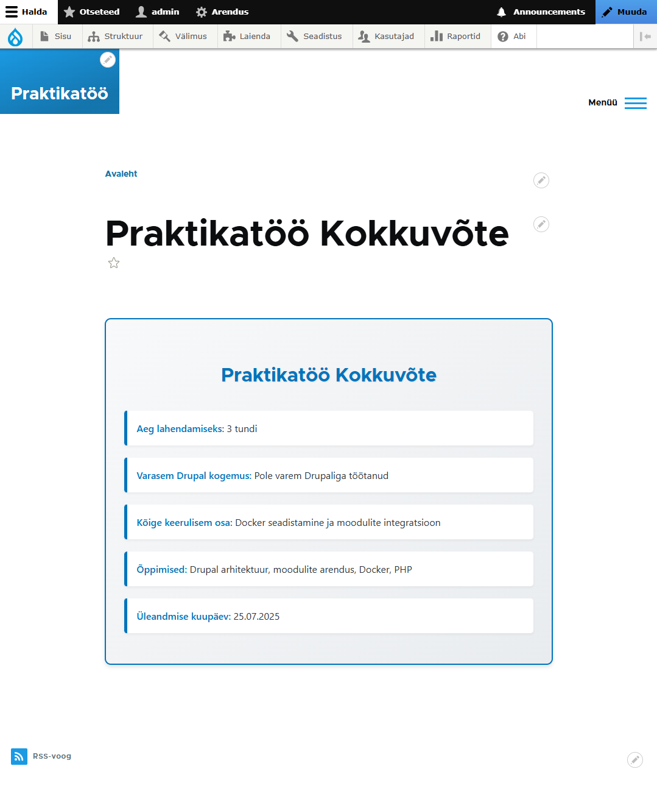

# Drupal 11 Praktikatöö

Drupal 11 LTS arenduskeskkond Docker keskkonnaga.



## Kiire käivitamine

### Eeltingimused:
- Docker Desktop
- Composer
- Git

### Käivitamine:

```bash
# 1. Klooni projekt
git clone [REPOSITORY_URL]
cd drupal-11-clean

# 2. Paigalda sõltuvused
composer install --ignore-platform-reqs

# 3. Käivita Docker
docker-compose up -d

# 4. Kontrolli olekut
docker-compose ps
```

### Kasutamine:
- **Pealeht:** http://localhost:8080
- **Admin:** http://localhost:8080/user/login
  - Kasutaja: `admin`
  - Parool: `admin123`

## Funktsionaalsused

✅ **Paigaldatud:**
- Drupal 11 (eesti keel)
- PostgreSQL 16 andmebaas
- Redis vahemälu
- Search API
- Admin Toolbar
- Security Kit (CSP)
- Pathauto (ilusad URL-id)
- 20 test artiklit
- Custom praktikatöö moodul

## Olulised lingid

- **Praktikatöö kokkuvõte:** http://localhost:8080/praktikatoo-kokkuvote
- **Admin:** http://localhost:8080/admin
- **Sisu:** http://localhost:8080/admin/content

## Probleemide lahendamine

```bash
# Taaskäivita konteinerid
docker-compose down
docker-compose up -d

# Tühjenda vahemälu
docker-compose exec drupal bash
cd /var/www/html && ./vendor/bin/drush cr
```

---
**Autor:** Praktikatöö | **Kuupäev:** 25.07.2025
